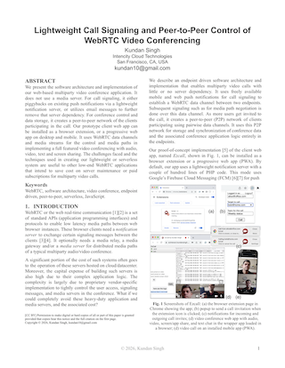

# EzCall

## Lightweight call signaling and peer-to-peer control of WebRTC video conferencing

Two main goals of this project are: (1) to show a lightweight call signaling
using push notifications, as well as serverless call signaling using 
email messaging, and (2) to do peer-to-peer control of video conferencing
application logic, using WebRTC API in the browser.

Please watch the [video demonstration](https://youtu.be/FV9POOuJPIQ), 
and read our [research paper](https://doi.org/10.48550/arXiv.2602.08975)
for more information including motivation, software architecture and
implementation details.

| Video Demonstration | Research paper |
|:-----:|:-----:|
|  |  |

## Paper Abstract

We present the software architecture and implementation of our web-based
multiparty video conference application. It does not use a media server.
For call signaling, it either piggybacks on existing push notifications
via a lightweight notification server, or utilizes email messages to further
remove that server dependency. For conference control and data storage,
it creates a peer-to-peer network of the clients participating in the call.
Our prototype client web app can be installed as a browser extension, or
a progressive web app on desktop and mobile. It uses WebRTC data channels
and media streams for the control and media paths in implementing a full
featured video conferencing with audio, video, text and screen sharing.
The challenges faced and the techniques used in creating our lightweight
or serverless system are useful to other low-end WebRTC applications that
intend to save cost on server maintenance or paid subscriptions for
multiparty video calls.

## Getting Started

Please contact the software owner, or join the discussion group mentioned below,
to get started with this project. There are many ways to use this software.

If you host this on your own website, then use your own Firebase cloud 
messaging/service account, and update index.php with the details. Make sure
that `index.php` is available at `/contacts` and the main web app of
`webapp-dist` is available at `/ezcall` on your website domain. Ensure 
that your database file, `contacts.db`, is not accessible from the 
web. 

If you want to use our hosted webapp, please get in touch with the owner, 
to get access password, and signin auth-token.

If you want to use the client in browser extension, enable developer mode in your
Chrome browser, and drag-drop the `chrome-extension.zip` file on the
extensions page to install. For using your Firebase cloud messaging/service
account, you will need to add your own data for this to work.
If you want to use the web app or installed 
app (progressive web app), just visit the main webapp, from Chrome browser
on Windows, Mac, or Android.

# License, copyright and contributions

The core software is released under dual license: AGPL (GNU Affero General Public License) as well as
Alternative commercial license.
In summary, if you keep this software to yourself, or make your whole product or service open-source,
then AGPL is fine; if you want to sell your own software with pieces of this project inside, even
if you are offering software-as-a-service or a cloud hosted product, you'll likely need to buy the
alternative commercial license.

If you are interested in sponsoring this project, or hiring (contract work) for
integration with your system, please reach out to the owner by email, mentioned
below. You can also join the 
[project support and discussion group](https://groups.google.com/u/1/g/theintencity)
for all our projects.

Software owner is **Kundan Singh ([theintencity@gmail.com](mailto:theintencity@gmail.com))**.
All pieces of this software including source code, documentation, and binaries are copyright
protected as *&copy; 2026, Kundan Singh &lt;theintencity@gmail.com&gt;*.

Any contributions to this software such as in the form of pull request
or suggested changes that gets merged or included is this software,
automatically get the copyright and ownership transferred to the
original software owner mentioned above, and turn into the dual license
term mentioned here, to be compatible with the original software
license. This clause allows the software owner to continue to provide
the open source offering at the dual license terms, and benefits
everyone.

